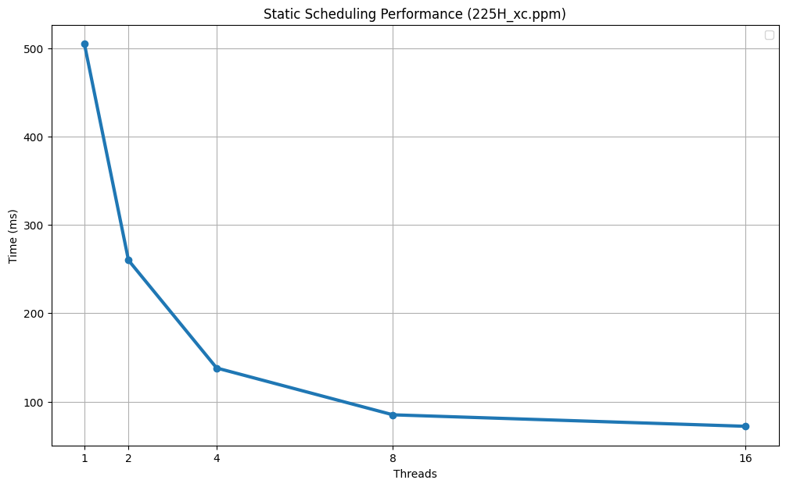
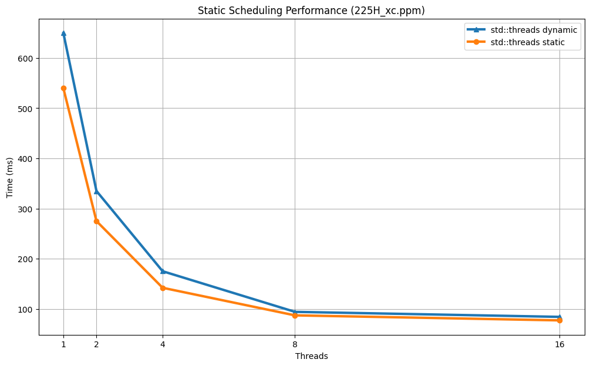

# Cpp threads project 
 Автоматическая настройка уровней изображения ( C++ std::threads ) Павлович Джурдже

## 1. Введение

Главная цель данной лабораторной работы - реализация параллельной обработки изображений с использованием стандартной библиотеки `std::threads`. Основные задачи включают:
1. Параллельный расчет гистограмм
2. Линейное масштабирование пикселей
3. Сравнение эффективности статического распределения нагрузки
4.  Демонстрация примера динамического и статического распределения нагрузки.


## 2. Характеристики тестового стенда

- CPU: AMD Ryzen 7 5800H 8 ядер / 16 потоков
- RAM: 32 GB
- OS: Windows 11
- Компилятор: GNU g++ 14.2.0

## 3. Реализация

### Основные компоненты системы

В работе используются следующие ключевые элементы:

Пул потоков:
Используется контейнер std::vector<std::thread> для управления потоками.

Мьютекс для синхронизации:
Для корректного объединения локальных гистограмм потоков применяется std::mutex merge_mutex.

Выполняется линейное масштабирование каждого пикселя по формуле:
`newVal = (oldVal - minY) / (maxY - minY) * 255`

### Параллельный подсчёт гистограммы
Для формата P6 (цветное изображение):

Функция processHistogramsP6 обрабатывает блок байтов (каждые 3 байта соответствуют одному пикселю) и вычисляет три локальные гистограммы (по одному для каждого канала). После обработки происходит объединение локальных гистограмм в глобальные с помощью мьютекса.

Для формата P5 (серогоe изображение):

Функция processHistogramsP5 аналогично вычисляет локальную гистограмму и объединяет её с глобальной.

### Параллельная обработка пикселей
Обработка пикселей выполняется в функции processPixels. Здесь каждый поток получает свою порцию данных, вычисляет новое значение яркости с учётом найденных minY и maxY, и масштабирует значение в диапазоне от 0 до 255. 
Статическое распределение нагрузки реализовано аналогичным образом: общее число пикселей делится на равные блоки, и оставшиеся пиксели распределяются между первыми потоками.


## 4. Тестирование
Тестирование проводилось на изображении **225H_xc.ppm**



В моём случае тестирования показала что статическое распределение лучше и быстрее работает чем динамическое на этойлабораторной

## 5. Пример динамического распределения

Поскольку динамическое распределение требует довольно серьезных изменений в коде, объединять оба варианта в одном main.cpp не выглядит очень элегантно. Поэтому я привожу здесь пример реализации динамического распределения на примере подсчёта гистограмм для изображения P6 — принцип тот же, что и для обработки пикселей.

```
size_t chunkSize = 9999;
    std::atomic<size_t> currentPixel(0);
    std::mutex merge_mutex;
    std::vector<std::thread> threads;

    int histogram1[256] = {0};
    int histogram2[256] = {0};
    int histogram3[256] = {0};
    int maxY, minY;
    volatile double tstart = omp_get_wtime();

    if (format == "P6")
    {
       
        if (numThreads > 1) 
        {   
            for (int i = 1; i < numThreads; ++i) {
               
                threads.emplace_back([&, chunkSize](){
                    processHistogramsP6(pixels, pixelCount, currentPixel, chunkSize, histogram1, histogram2, histogram3, merge_mutex);
                });         
            }
            processHistogramsP6(pixels, pixelCount, currentPixel, chunkSize, histogram1, histogram2, histogram3, merge_mutex);

            for (auto& t : threads) t.join();
            threads.clear();
```

```
void processHistogramsP6( std::vector<unsigned char> &pixels, size_t pixelCount, std::atomic<size_t> &currentPixel,
                        size_t chunkSize, int (&histogram1)[256], int (&histogram2)[256], int (&histogram3)[256], std::mutex& merge_mutex){

    int localHistogram1[256] = {0};
    int localHistogram2[256] = {0};
    int localHistogram3[256] = {0};

    while(true)
    {
        const size_t startPixel = currentPixel.fetch_add(chunkSize);

        if(startPixel >= pixelCount) break;

        const size_t endPixel = std::min(startPixel + chunkSize, pixelCount);
        const size_t start = startPixel * 3;
        const size_t end = endPixel * 3;

        for (size_t i = start; i < end; i += 3)
        {
            localHistogram1[(int)pixels[i]]++;
            localHistogram2[(int)pixels[i+1]]++;
            localHistogram3[(int)pixels[i+2]]++;
        }
    }
    
    std::lock_guard<std::mutex> lock(merge_mutex);
        for (int j = 0; j < 256; j++)
        {
            histogram1[j] += localHistogram1[j];
            histogram2[j] += localHistogram2[j];
            histogram3[j] += localHistogram3[j];
        }  
};
```
Главная идея заключается в том, что каждый поток с помощью атомарной переменной получает уникальный «чанк» для обработки до тех пор, пока общее количество пикселей не будет обработано. Это позволяет динамически балансировать нагрузку между потоками.
